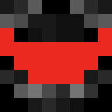

# Mitglieder
Auf dieser Seite findet ihr eine Liste der MAUN-Mitglieder. Klicke auf den Namen, um den selbstgeschriebenen Steckbrief zu öffnen.

## Gründer
<table>
    <tr>
        <td align="center" style="vertical-align:middle"><b>Avatar</b></td>
        <td align="center" style="vertical-align:middle"><b>Name</b></td>
    </tr>
    <tr>
        <td height="55px" align="center" style="vertical-align:middle"></td>
        <td height="55px" align="center" style="vertical-align:middle"><a href="https://themaun.github.io/Mitglieder/Diamanttron">Diamanttron</a> (inaktiv)</td>
    </tr>
    <tr bgcolor="#CCEEFF">
        <td height="55px" align="center" style="vertical-align:middle"></td>
        <td height="55px" align="center" style="vertical-align:middle"><a href="https://themaun.github.io/Mitglieder/Sir_Dijamond">Sir Dijamond</a></td>
    </tr>
</table>

## Leitung
<table>
    <tr>
        <td align="center" style="vertical-align:middle"><b>Avatar</b></td>
        <td align="center" style="vertical-align:middle"><b>Name</b></td>
    </tr>
    <tr>
        <td height="55px" align="center" style="vertical-align:middle"></td>
        <td height="55px" align="center" style="vertical-align:middle"><a href="https://themaun.github.io/Mitglieder/GhostsharkHD">GhostsharkHD</a></td>
    </tr>
    <tr bgcolor="#CCEEFF">
        <td height="55px" align="center" style="vertical-align:middle"></td>
        <td height="55px" align="center" style="vertical-align:middle"><a href="https://themaun.github.io/Mitglieder/IghBinEineWaffel">IchBinEineWaffel</a></td>
    </tr>
    <tr>
        <td height="55px" align="center" style="vertical-align:middle"></td>
        <td height="55px" align="center" style="vertical-align:middle"><a href="https://themaun.github.io/Mitglieder/Loic">Loïc</a></td>
    </tr>
    <tr bgcolor="#CCEEFF">
        <td height="55px" align="center" style="vertical-align:middle"></td>
        <td height="55px" align="center" style="vertical-align:middle"><a href="https://themaun.github.io/Mitglieder/Sir_Dijamond">Sir Dijamond</a></td>
    </tr>
</table>
